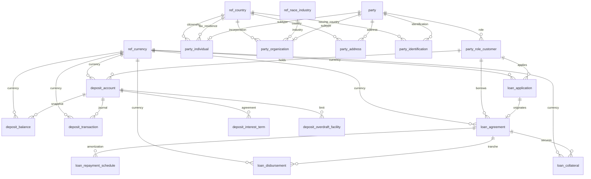

# Architecture & Design

This document describes the platform's architecture, data model, and design rationale — what the
system is and why it is shaped this way. For container-by-container operational detail, script
behavior, and troubleshooting, see [`APPLICATION_RUNBOOK.md`](APPLICATION_RUNBOOK.md).

This is a proof-of-concept. Everything described in this document — [System
Architecture](#system-architecture), [Data Model](#data-model), and [Security
Model](#security-model) — is implemented and runnable today. For what is *not* built yet, together
with known issues and their remediation plan, see
[`PLATFORM_ANALYSIS_PLAN.md`](PLATFORM_ANALYSIS_PLAN.md).

---

## System Architecture

The platform is layered bottom-to-top: raw data is ingested and stored, given semantic and graph
structure, made retrievable by AI agents, and exposed to consumers — with governance and guardrails
cutting across every layer.

```
+---------------------------------------------------------------------------------------------------+
|                        TIER 6: AI-ENABLED CONSUMPTION & APPLICATIONS                              |
|  [Streamlit Web UI Explorer]   [Autonomous AI Agents]   [Grafana Dashboard]   [SaaS & Apps]        |
+---------------------------------------------------------------------------------------------------+
                                                  ^
                                                  |
+---------------------------------------------------------------------------------------------------+
|                        TIER 5: AGENTIC PROTOCOL & INTERFACE LAYER                                 |
|  [Model Context Protocol (MCP) Server]      [Ollama Autonomous Tool-Calling Runner]               |
+---------------------------------------------------------------------------------------------------+
                                                  ^
                                                  |
+---------------------------------------------------------------------------------------------------+
|                        TIER 4: AI CONTEXT & RETRIEVAL INFRASTRUCTURE                              |
|  [2-Stage Neural Cross-Encoder Re-Ranker]   [Dynamic Text-to-Cypher Builder]   [Hybrid RAG]        |
+---------------------------------------------------------------------------------------------------+
                                                  ^
                                                  |
+---------------------------------------------------------------------------------------------------+
|                        TIER 3: SEMANTIC, KNOWLEDGE & METADATA LAYER                               |
|  [Cube.js Semantic Layer]  [Neo4j Knowledge Graph]  [OpenMetadata Catalog]  [W3C FIBO Grounding]   |
+---------------------------------------------------------------------------------------------------+
                                                  ^
                                                  |
+---------------------------------------------------------------------------------------------------+
|                        TIER 2: MULTI-MODEL STORAGE & COMPUTE DATA PLANE                           |
|  [Supabase PostgreSQL (pgvector)]      [Neo4j Graph Database]      [MySQL Catalog Database]        |
+---------------------------------------------------------------------------------------------------+
                                                  ^
                                                  |
+---------------------------------------------------------------------------------------------------+
|                        TIER 1: DATA INGESTION & INTEGRATION LAYER                                 |
|  [PostgreSQL Seed Pipeline]      [End-to-End Lineage Sync]      [Synthetic Data Generator]         |
+---------------------------------------------------------------------------------------------------+

=====================================================================================================
=== CROSS-CUTTING: AUTH & ACCESS CONTROL   PII REDACTION   PROMPT GUARDRAILS   TELEMETRY & OBSERVABILITY ===
=====================================================================================================
```

### Tier responsibilities

| Tier | Role | Built with |
|---|---|---|
| 1. Ingestion | Populate the relational core from a synthetic BIAN/FIBO dataset | `scripts/generate_synthetic_data.py`, `scripts/build_knowledge_graph.py`, `scripts/sync_end_to_end_lineage.py` |
| 2. Storage | Multi-model data plane | Supabase PostgreSQL + pgvector, Neo4j 5 Community, MySQL (OpenMetadata's own backing store) |
| 3. Semantic & governance | Business metrics, catalog, ontology grounding | Cube.js, OpenMetadata, `ontology/*.ttl` |
| 4. Retrieval | Turns tiers 2–3 into LLM-ready context | `scripts/hybrid_rag_retriever.py` (vector + graph + metrics + SQL), `scripts/neural_reranker.py`, `scripts/text_to_cypher_builder.py` |
| 5. Agentic protocol | Standardized tool interface for AI agents | `mcp_server/financial_data_mcp_server.py` (FastMCP, stdio or SSE) |
| 6. Consumption | Human and agent-facing surfaces | Streamlit dashboard, Grafana |
| Cross-cutting | Security and operational visibility | `scripts/ai_safety_guardrails.py`, `scripts/llmops_telemetry.py`, Prometheus (+ `node_exporter`/`postgres_exporter`/`mysqld_exporter`/`cadvisor`/Neo4j JVM exporter, `catalog/prometheus_rules.yml`, `alertmanager`), real OTel distributed tracing (`scripts/_otel_tracing.py` -> `otel_collector` -> `tempo`) |

See [`../CLAUDE.md`](../CLAUDE.md) for the exact commands that start and operate this stack, and the
runbook for a script-by-script breakdown of every component named above.

### Data domains

Three BIAN/FIBO-aligned domains, each with its own OpenMetadata data product and ODCS-inspired
contract under [`contracts/`](../contracts/): `Party_Customer_Domain`, `Deposit_Liquidity_Domain`,
`Loan_Credit_Risk_Domain`. Every table and Cube.js cube name is strictly prefixed by its owning
domain:

- **Reference (`ref`):** `ref_currency`, `ref_country`, `ref_nace_industry` — shared lookup data, not
  owned by any single domain.
- **Party (`party`):** `party`, `party_individual`, `party_organization`, `party_role_customer`,
  `party_address`, `party_identification`.
- **Deposit (`deposit`):** `deposit_account`, `deposit_balance`, `deposit_transaction`,
  `deposit_interest_term`, `deposit_overdraft_facility`.
- **Loan (`loan`):** `loan_application`, `loan_agreement`, `loan_repayment_schedule`,
  `loan_disbursement`, `loan_collateral`.

### How the retrieval and metadata layers relate

These four concepts sound similar and are easy to conflate — each plays a distinct role:

- **Catalog (OpenMetadata):** technical and operational metadata — schemas, owners, quality
  assertions, lineage, PII tags — about the data assets themselves.
- **Semantic layer (Cube.js):** business-friendly metrics and dimensions over the relational tables
  (e.g. `total_available_balance`), for deterministic aggregate queries.
- **Ontology (`ontology/*.ttl`):** the formal class/property vocabulary — what a `Party` or a
  `DepositAccount` *is* — grounded against W3C FIBO and BIAN, independent of any physical storage.
- **Knowledge graph (Neo4j):** concrete instance data — actual customers and accounts as nodes and
  edges — loaded according to that vocabulary, used for multi-hop traversal.

`scripts/hybrid_rag_retriever.py` is the component that draws on all four at once, alongside a
pgvector similarity search, to assemble context for an LLM in a single call.

---

## Data Model

### Naming convention

Every table name is prefixed by its owning data product (`ref_`, `party_`, `deposit_`, `loan_`), so
domain ownership is always recoverable from the table name alone. The full DDL lives in
[`supabase/migrations/`](../supabase/migrations/) and is summarized in [`schema.dbml`](../schema.dbml).

### Entity relationships



### Normalization

The core schema is Inmon-style 3NF: every attribute is atomic, non-key attributes depend on the
whole primary key, and reference values (currencies, countries, industries) are normalized into
dedicated `ref_*` lookup tables rather than repeated inline.

### Temporal design (SCD Type 2)

Every table in `financial.*` carries the same five-column header, in this order:

| Column | Type | Meaning |
|---|---|---|
| `md_created_at_utc` | `TIMESTAMPTZ` | Record insertion time |
| `md_updated_at_utc` | `TIMESTAMPTZ` | Last update time (maintained by a `BEFORE UPDATE` trigger) |
| `md_valid_from_utc` | `TIMESTAMPTZ` | Effective start of this version |
| `md_valid_to_utc` | `TIMESTAMPTZ` | Effective end of this version (`9999-12-31 23:59:59+00` while active) |
| `md_is_active` | `BOOLEAN` | `TRUE` for the current version, `FALSE` for a superseded one |

**Design intent vs. current implementation:** the schema is built to support full SCD2 versioning —
querying "as of" any point in time by filtering on `md_valid_from_utc`/`md_valid_to_utc`, and querying
current state by filtering `md_is_active = TRUE`. In the current synthetic dataset, only
`financial.party` actually carries superseded (`md_is_active = FALSE`) rows; the other fifteen
tables contain current versions only, and there is no close-and-insert procedure yet that produces a
second version on update — the update trigger only maintains `md_updated_at_utc`. Treat the temporal
columns as the intended long-term pattern, not yet as data every table exercises. Any query or
Cube.js measure that aggregates across a table without filtering `md_is_active = TRUE` will double-count
once that gap is closed — see the note on this in the runbook's Cube.js section.

**Current-state query pattern**, filtering every join leg explicitly:

```sql
SELECT
    p.party_bk,
    pi.first_name,
    pi.last_name,
    c.customer_number,
    da.account_number,
    db.available_balance,
    da.currency_code
FROM financial.party p
JOIN financial.party_individual pi
  ON pi.party_id = p.party_id AND pi.md_is_active = TRUE
JOIN financial.party_role_customer c
  ON c.party_id = p.party_id AND c.md_is_active = TRUE
JOIN financial.deposit_account da
  ON da.customer_id = c.party_role_customer_id AND da.md_is_active = TRUE
JOIN financial.deposit_balance db
  ON db.deposit_account_id = da.deposit_account_id AND db.md_is_active = TRUE
WHERE p.md_is_active = TRUE;
```

---

## Security Model

- **PostgREST / HTTP exposure:** `financial` and `ref` are not published through Supabase's PostgREST
  API (`supabase/config.toml`'s `[api].schemas`) — nothing in the platform uses that surface; the MCP
  server, pipeline scripts, and Cube.js all reach Postgres over the wire protocol on `[db].port`
  directly. Both schemas also have Row-Level Security enabled with no policies for the `anon`/
  `authenticated` Supabase roles (deny-by-default), so even a schema re-added to the PostgREST list by
  mistake would expose no rows. See `supabase/migrations/20260807150000_enable_rls_and_restrict_anon_access.sql`.
- **Database access — least privilege:** the MCP server and the hybrid RAG retriever connect as
  `mcp_readonly` (`supabase/migrations/20260807151500_create_mcp_readonly_role.sql`), not the
  `postgres` superuser — a non-superuser role that can `SELECT` on `financial`/`ref` only and cannot
  call filesystem/OS-access functions (`pg_read_file`, `COPY ... TO PROGRAM`, etc.) at all, regardless
  of what any application-level check misses. Neo4j (Community Edition, which has no custom-role RBAC)
  gets the closest equivalent: `query_neo4j()` opens sessions with `default_access_mode=READ_ACCESS`,
  which the server enforces by rejecting write clauses independent of any keyword check.
  `scripts/ai_safety_guardrails.py`'s SQL/Cypher keyword-based read-only check runs before either of
  these as a first layer, not the only one.
- **Service authentication:** Cube.js (`CUBEJS_API_SECRET`) and the MCP SSE sidecar (`MCP_API_KEY`)
  both require a bearer token, enforced in `cube/cube.js` and `mcp_server/financial_data_mcp_server.py`
  respectively. Neither has a hardcoded fallback — see `CLAUDE.md`'s Secrets convention. The MCP SSE
  endpoint refuses to start at all without `MCP_API_KEY` set (rather than falling back to
  unauthenticated), and defaults to binding `127.0.0.1` only.
- **PII handling:** `scripts/_pii_classification.py` is the single shared source of truth for which
  column names count as PII (`PII_PERSONAL_PATTERNS`/`PII_SPECIAL_PATTERNS`), consumed by three
  independent enforcement points: `scripts/automate_openmetadata_pii_and_profiling.py`
  (catalog tagging), `cube/model/cubes/*.yml`'s `public: false` dimensions + `cube/cube.js`'s
  `queryRewrite` (Cube.js — `public: false` alone only affects GraphQL/Playground introspection in
  this Cube.js version, not the REST query path; `queryRewrite` is the real block, kept in sync with
  the YAML by `tests/test_pii_cube_enforcement.py`), and `AISafetyGuardrails.redact_row`/`redact_rows`
  (field-aware redaction by real column name, used by `query_financial_database`/`query_knowledge_graph`'s
  MCP tool responses and recursively within `sanitize_context_payload`). `AISafetyGuardrails.redact_pii`'s
  blanket value-shape regexes remain as the fallback for genuinely free-text content with no fixed
  schema (descriptions, prompts) — label-anchored where shape alone is ambiguous (DOB, passport/
  national-ID/tax-ID mentions); the returned redaction mapping stores only a PII category label, never
  the original un-redacted value. `sanitize_context_payload` quarantines detected prompt-injection
  spans (replacing them in the payload, not just flagging `safety_status` in unread metadata) and
  always attaches an explicit untrusted-data notice.
- **Retrieval honesty:** `scripts/hybrid_rag_retriever.py` and `scripts/neural_reranker.py` fail
  closed (raise, don't silently substitute) if the real embedding/cross-encoder models can't load,
  via `scripts/_embedding_backend.py` — set `ALLOW_DEGRADED_EMBEDDINGS=1` to explicitly opt into a
  non-semantic fallback instead, in which case every result is tagged `embedding_mode`/
  `reranker_mode: "degraded"` so it can't be mistaken for real retrieval.
- **Observability:** the MCP sidecar serves real Prometheus metrics for every tool call
  (`prometheus_client`, `mcp_server/financial_data_mcp_server.py`'s `main()`) — there is no separate
  simulator process; Grafana panels move only in response to genuine tool invocations.

This is the intended model, and the items above reflect its current state, not just its design
intent. The prompt-injection check remains a fixed regex list — paraphrase, other languages, or
encoding can still evade detection, even though a detected match is now actually removed from the
payload rather than merely flagged — and audit logging of which agent ran which query does not yet
exist. Both are tracked as implementation work, not architecture changes, so they live outside this
document.

---

For proposed extensions beyond the architecture described above, along with the ranked issue list
and remediation plan, see [`PLATFORM_ANALYSIS_PLAN.md`](PLATFORM_ANALYSIS_PLAN.md).
